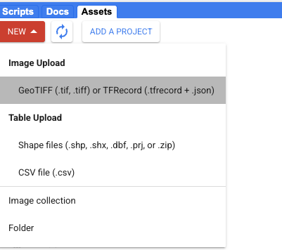

# Uploading New Forecast Data

In this section, we will show you how to upload custom forecast data into the maptool. GEE does not generate forecasts on its own, but can take any spatial data generated by outside processes as input. (A number of common global forecast products, such as the GFS and ECMWF weather forecasts, are also available through the Earth Engine Catalog.)

You can upload new forecast data as an Earth Engine Asset, similar to how you uploaded a shapefile previously. We have set up the data pipeline to easily integrate downscaled probabalistic forecast data from the [PyCPT](https://iri-pycpt.github.io/) software tool (which is used by a large number of regional climatologists). 



# Forecast Filetype Conversion

GEE can only take .tiff format raster data as input, but many forecasts are output as .ncdf files. For a simple conversion script, see [here](https://github.com/ccsfist/netcdf_to_tiff).

# Code Integration

To integrate forecast data into the hazard analysis maptool, change the following lines:

```
  // forecast
  
  /// first, convert to imageCollection

  var forecast_raw = ee.Image("projects/ee-maxmauerman/assets/belize_forecast_mu_mar") ; // change this filepath 
  var bands = forecast_raw.bandNames() ;
  var list = bands.map(function(n) { return forecast_raw.select([n]) }) ;
  var collection = ee.ImageCollection.fromImages(list) ;
  
  /// then assign time index
  
  var timeList = ee.List.sequence(1993,2022) ;
  
  var forecast = collection.map(function(img) {
    var index = ee.Number.parse(img.get('system:index')) ;
    var selectYear = timeList.get(index) ;
    var imgFormatted = img.rename(['precip']).divide(30).set('year',ee.Number(selectYear)) ;
    
    return imgFormatted ;
    
  }).filter(ee.Filter.gte('year',year_start))
    .filter(ee.Filter.lte('year',year_end));
  
```

Note the subsequent lines where we format the multi-band .tiff data into an Earth Engine ImageCollection (with one layer per time period), so it can be easily accesed by other functions. 

To integrate forecast data into the monitoring maptool, change the following lines:

```
var forecast = ee.Image("projects/ee-maxmauerman/assets/belize_forecast_mu_mar").select("b30").divide(30), // change this filepath
    forecast_var = ee.Image("projects/ee-maxmauerman/assets/belize_forecast_var_mar").divide(900); // change this filepath 
```

Note that by default, the monitoring dashboard is designed for probabalistic forecasts, and thus takes two file inputs - one for the forecast mean, and a second for the variance. Also note the unit conversion -- in this case, the forecast was generated in reference to monthly rainfall totals, so in order to make it compatible with the daily CHIRP data, we must convert it into commensurate units. 

<div id="slide-config" data-type="simple" data-next="../export/" data-kobo-id="hACTMCaZ" data-width="100%"> </div>

