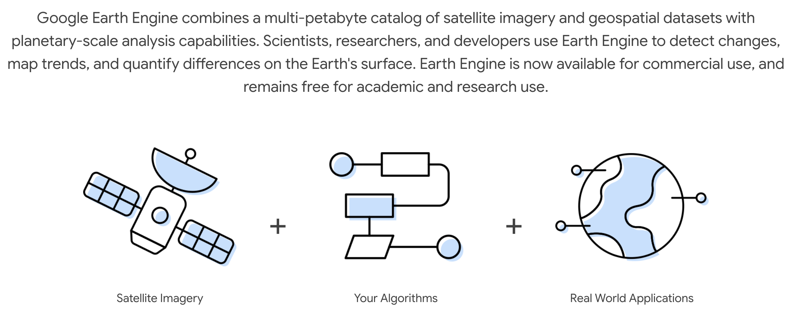

# Introduction

This is the second part of a three-point workshop on designing multi-hazard early warning systems in Belize.

In the first part, we went through the principles of how to co-design user-driven early warning triggers, and introduced the tools we use to unpack those design choices.

In the this part, we will show you the technical details of how to customize those tools to your purposes, using the free Google Earth Engine software platform. If you have not already, please create a free account on Google Earth Engine and send your username to max.mauerman@columbia.edu:

https://code.earthengine.google.com/register

 

