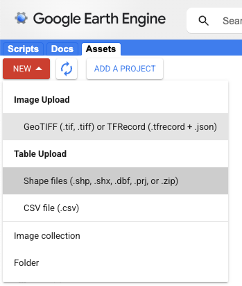

# Customizing Shapefiles

In this section, we will show you how to change the shapefiles in the maptool to point to your own source of data.

# Upload Files



First, you must upload the shapefile as an Earth Engine asset, as pictured above. Be sure to include all of the accompanying files that it asks for.

# Change Global Parameters

Before:

```
var muni = ee.FeatureCollection('WM/geoLab/geoBoundaries/600/ADM2').filter(ee.Filter.eq("shapeGroup","BLZ")) ;

```

After: 

```
var muni = ee.FeatureCollection('yourFilePath').map(function(feat){ // add your shape's file path here
	return ee.Feature(feat.geometry(), {
		shapeName: feat.get('nameProperty') // change to whatever the shape name property is called in your file
	})
}) ;

```

Then, go to the dashboard code and change the "muni" object to point to the filepath of the shape you just uploaded. Be sure to include the second line, in which you rename the property identifying the name of each shape to "shapeName" for consistency with the subsequent code. 

<div id="slide-config" data-type="simple" data-next="../metrics/" data-kobo-id="hACTMCaZ" data-width="100%"> </div>

