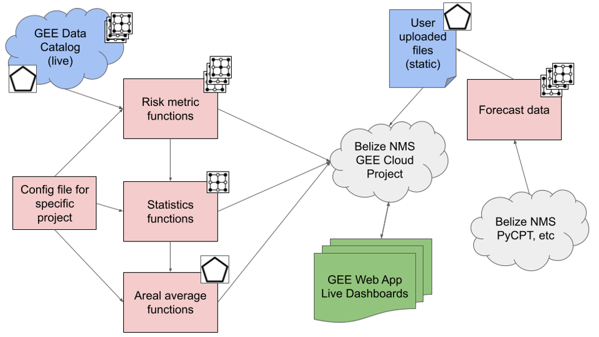

# Earth Engine Overview

The core of the Risk Analysis Maptool is implemented in Google Earth Engine (GEE). GEE is a free (to government and nonprofit use), cloud-based service designed to facilitate applications which rely on processing large climate and geospatial datasets. GEE has [robust documentation](https://developers.google.com/earth-engine/) and a [wide range of tutorials](https://courses.spatialthoughts.com/end-to-end-gee.html) for new users.

In this workshop, we will focus on the specific tools that we have developed for multi-hazard early warning systems and how to customize them.  

# Project Workflow

- Blue: Data inputs
- Red: Code
- Green: Outputs
- Grey: Storage

The Risk Analysis toolkit breaks down common data manipulation and analysis tasks into a series of simple functions. These functions can be adjusted to suit the scope of a given analysis – for instance, changing the geography or time span under study – without the need to code every intermediate step from scratch. The toolkit functions are organized into four categories, following the logical order in which data manipulation steps typically take place:
 
- 1 Hazard metrics: Ingest raw climate data from the GEE Catalog and transform it into a relevant hazard metric.
	- Output: ImageCollection (time series of rasters)
- 2 Statistics: Transform time series of hazard metric data into summary indicators such as mean, standard deviation, trend, etc. As part of this process, the hazard metric may be calibrated against some measure of the population exposed to risk.
	- Output: Image (single raster of statistics)
- 3 Areal averages: Spatially average hazard, exposure and vulnerability statistics over the relevant project areas, which may be defined by administrative boundaries and / or other polygons.
	- Output: FeatureCollection (set of spatial average statistics by polygon)
- 4 Dashboards and exports: Combine data from steps 1-3, along with forecast, exposure, vulnerability and impact data, into an interactive web application. 
	- Output: Interactive map via GEE web application, including links to download data as a table.
 
All of the steps share a common GEE Cloud database, code repository and set of functions.

We have set up several template dashboards for various hazards. You can customize these templates for each of the following steps:

- Setting the common (“global”) parameters for the analysis (time span, geography, etc.), 
- Computing a measure of climate hazard in each year,
- Computing a measure of long-term exposure to climate hazard,
- Computing areal summary measures of exposure and vulnerability for each geographic region (which may be exported for additional analysis),
- Mapping and visualizing the data and defining the interactive elements of the dashboard.

In the following sections, we will detail how each of these steps functions, and how to customize it.

 

