## Executive Summary

This document summarizes the desk review conducted for the Belize climate risk assessment project, focusing on climate risk and vulnerability assessment. The review consolidates input from multiple government ministries and agencies regarding priority natural hazards, preferred datasets, and capacity for community validation. Information presented in this document is based on:

- Consultations with government ministries and agencies (see Ministry Consultations section)
- Review of existing climate risk assessments and data sources
- Analysis of forecast products and data availability
- Desk review of relevant literature and resources

### Project Overview and Strategic Imperative

This report synthesizes the findings of the inception phase, which involved a comprehensive review of the country's hydro-meteorological capabilities, institutional architecture, and socio-economic vulnerability landscape. Furthermore, it presents a preliminary hazard mapping analysis, utilizing advanced Earth Observation (EO) techniques and local datasets to identify the spatial intersection of hazard probability and community exposure.

### The Climate Risk Context

The Global Climate Risk Index and World Bank profiles consistently highlight Belize's exposure, driven by its geography, a low-lying coastal plain transitioning to a mountainous interior, and its economy, which is heavily reliant on climate-sensitive sectors including agriculture and tourism [1].

Recent events have demonstrated the variable and compound nature of Belize's climate risk. The severe drought of 2019, which significantly impacted the agricultural sector, was followed by the compound impacts of Hurricanes Eta and Iota in 2020 and Hurricane Lisa in 2022. Most recently, Tropical Storm Sara (November 2024) demonstrated the vulnerability of the river valley systems, causing widespread inundation and infrastructure failure [2]. Future climate projections indicate a potential 50% decline in mean annual rainfall over the next century, threatening the viability of the northern belt, coupled with an increase in the intensity of rainfall events in the south, which would exacerbate flash flood risks [1].


---

## Climate Context

The following climate context information, visualizations, and analyses are sourced from the World Bank Climate Change Knowledge Portal (CCKP) for Belize. For more detailed information, visit: https://climateknowledgeportal.worldbank.org/country/belize

### Köppen-Geiger Climate Classification

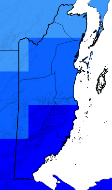{height=400px}

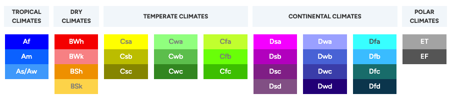{height=100px width=600px}

**Figure:** Köppen-Geiger climate classification for Belize (1991-2020 climatology).

The Köppen-Geiger climate classification system is widely used as a simple, yet effective way for categorizing the world's climates based on temperature and precipitation conditions.

### Understanding the Data: Implications and Utility

This classification is useful to help users understand and describe what the climate is like in different regions of the world. The Köppen system is based on defined temperature and precipitation thresholds and changes in these variables over time can cause a region to shift from one climate classification to another. This visual presentation offers a spatial understanding of climate zones and sub-classifications globally. These shifts are strong indicators of changing climates and aid understanding of changes in specific areas of interest, for example:

- Areas of southern Europe classified as Csa (Hot-summer, Mediterranean climate) may be shifting toward BSh (Hot, semi-arid climate) as rainfall decreases and temperatures rise.
- Regions in the Arctic once classified as ET (Tundra) are seeing warming trends that may eventually reclassify them as Dfc (Subarctic climate), reflecting potential for a longer growing season.

This map applies this classification system to the latest climatology (1991-2020) of Climate Research Unit (CRU) data.

Full classifications and corresponding calculations can be reviewed here: [Köppen-Geiger Classification Paper (2006)](https://koeppen-geiger.vu-wien.ac.at/pdf/Paper_2006.pdf)

The original Köppen Classification system can be reviewed here: [Köppen Classification (1884)](https://koeppen-geiger.vu-wien.ac.at/pdf/Koppen_1884_2.pdf)

---

### Population

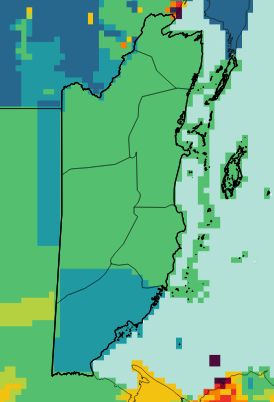{height=400px}

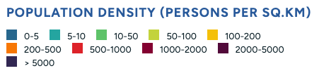{height=100px width=600px}

**Figure:** Population density distribution for Belize (2020).

The Gridded Population of the World, Version 4 (GPWv4): Population Density, Revision 11 consists of estimates of human population density (number of persons per square kilometer) based on counts consistent with national censuses and population registers, for the years 2000, 2005, 2010, 2015, and 2020. The CCKP presents data for the year 2020.

**Source:** Gridded Population of the World, Version 4 (GPWv4): Population Density, Revision 11 – 2.5 arc-minute resolution. Available at: <https://cmr.earthdata.nasa.gov/search/concepts/C1597159135-SEDAC.html>

### Actionable Insights: Population Exposure

The population density map reveals that the highest concentrations of people are in low-lying coastal areas.

**Actionable Insight:** Coastal hazards like storm surges and sea-level rise have a disproportionately high impact on the "Exposure" metric of risk. This spatial distribution of population should inform prioritization of coastal hazard monitoring and climate risk assessments.

---

### Topography (Elevation)

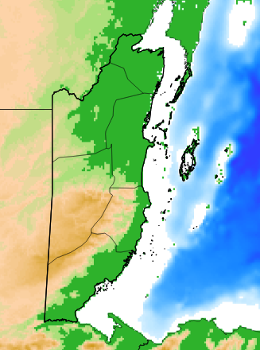{height=400px}

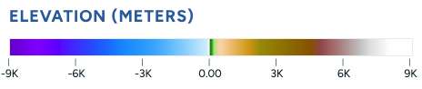{height=100px width=600px}

**Figure:** Topographic elevation map of Belize.

The ETOPO Global Relief Model combines topography, bathymetry, and shoreline data from both regional and global sources to provide a detailed, high-resolution representation of Earth's surface features. As presented in the CCKP, the bedrock elevation layer, representing surface height with ice sheets and vegetation removed, is used at a resolution of 60 arcseconds (approximately 1.8 km). At this coarse resolution, sharp peaks are smoothed out, so even the highest mountain ranges appear with reduced elevations, typically around 6,000 meters.

**Source:** NOAA. Available at: <https://data.noaa.gov/metaview/page?xml=NOAA/NESDIS/NGDC/MGG/DEM//iso/xml/etopo_2022.xml&view=getDataView&header=none>

**Data download:**
- <https://www.ncei.noaa.gov/products/etopo-global-relief-model>
- <https://www.ncei.noaa.gov/maps/grid-extract/>

### Actionable Insights: North-South Climate Divide

The Köppen-Geiger and Topography maps show a distinct North-South divide. Southern Belize is characterized by a **Tropical Rainforest (Af)** climate and higher elevations (Maya Mountains), while the North is a flatter **Tropical Monsoon (Am)** zone.

**Actionable Insight:** Flood triggers in the South should likely focus on rapid-onset flash floods due to terrain, while the North is more susceptible to slow-onset inundation and agricultural drought. This spatial differentiation should inform the design of region-specific forecast-based action triggers and early warning systems.

---

### Observed Seasonal Cycle

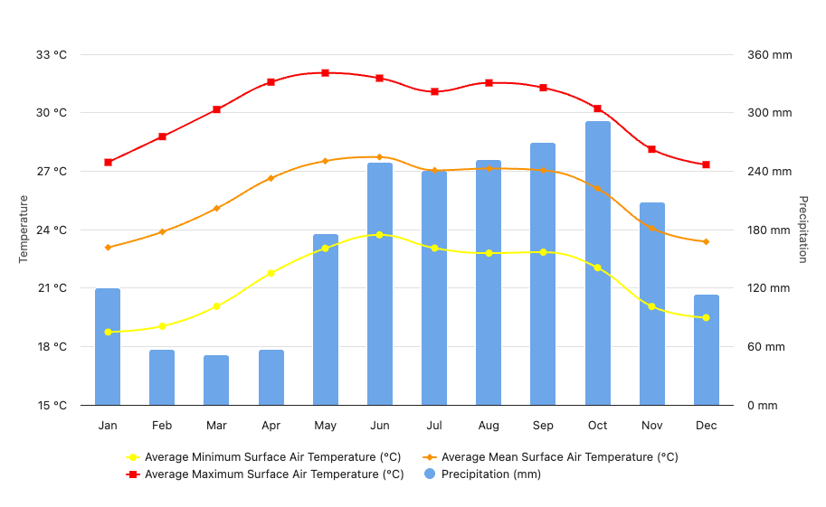{height=400px}

**Figure:** Observed seasonal cycle showing average minimum, mean, and maximum surface air temperature, and precipitation for Belize (1991-2020).

Temperature, precipitation, and other expressions of climate change throughout a 12 month period. This basic climatology chart provides the fundamentals of seasonality.

### Actionable Insights: Seasonal Rainfall Patterns

The Observed Seasonal Cycle chart confirms two rainfall peaks: a primary peak in June and a secondary, higher peak in October.

**Actionable Insight:** Anticipatory action protocols for flooding should be pre-positioned and ready for activation by late May and early September to align with these peak rainfall periods. This seasonal timing should guide the scheduling of preparedness activities, resource mobilization, and community awareness campaigns.

---

### El Niño–Southern Oscillation (ENSO) Analysis

El Niño–Southern Oscillation (ENSO) is the most important driver of interannual natural climate variability on a global scale. ENSO alternates between El Niño (warm phase) and La Niña (cool phase) approximately every 3–7 years, with neutral periods in between, shaping worldwide patterns of temperature, rainfall, and extreme events such as droughts, floods, and heatwaves.

During El Niño, the eastern Pacific experiences warmer and wetter-than-usual conditions, while the western Pacific tends to become drier. La Niña reflects the opposite pattern. ENSO activity typically peaks in boreal winter (December-January-February, DJF), while its impact on global mean surface temperature is delayed, with the strongest signal appearing about 6–7 months later. These shifts have far-reaching consequences for agriculture, health, infrastructure, and livelihoods, particularly in vulnerable regions. Moreover, during the warm phase, weaker trade winds and reduced upwelling in the eastern Pacific limit the supply of cold, nutrient-rich waters, disrupting marine ecosystems and fisheries in the region.

El Niño events are commonly classified based on the location of maximum sea surface temperature (SST) anomalies in the tropical Pacific. Two primary types are recognized: Eastern Pacific (EP) El Niño and Central Pacific (CP) El Niño. EP El Niños, often referred to as "canonical" events, are characterized by pronounced SST warming in the eastern equatorial Pacific, particularly off the coasts of South America. These events are typically associated with strong atmospheric responses, including heavy rainfall and flooding in countries like Peru and Ecuador.

In contrast, CP El Niños, sometimes called "El Niño Modoki", exhibit peak SST anomalies farther west, near the dateline in the central Pacific. These events tend to produce weaker or more spatially displaced atmospheric impacts, and recent studies suggest they have become more frequent in recent decades.

The CCKP presents correlations between ERA5 reanalysis climate data and the Oceanic Niño Index (ONI), which primarily reflects SST anomalies averaged over the central equatorial Pacific (Niño 3.4 region). This makes it particularly relevant for capturing the influence of CP El Niño events.

El Niño or La Niña events occur on top of the long-term climate change baseline, meaning that the combined extremes can be more severe than those caused by ENSO or climate change alone. Understanding how El Niño–La Niña influences specific regions is therefore essential for preparedness and adaptation planning.

While ENSO dominates at the global scale, other regional modes of variability can play a stronger role regionally, such as the Indian Ocean Dipole (IOD), North Atlantic Oscillation (NAO), or the Southern Annular Mode (SAM).

In the CCKP analysis, the Oceanic Niño Index (ONI) is used to represent central Pacific Niño, which uses SST data in the central equatorial Pacific (5° N–5° S, 170° W–120° W, also known as 3.4 region) (see more <https://www.ncei.noaa.gov/access/monitoring/enso/sst>). An El Niño or La Niña event is typically defined when the index exceeds ±0.5 °C for six months or more. Other regions and indices capture different "flavors" of ENSO, and these can be explored in further analyses.

### Time Series Analysis

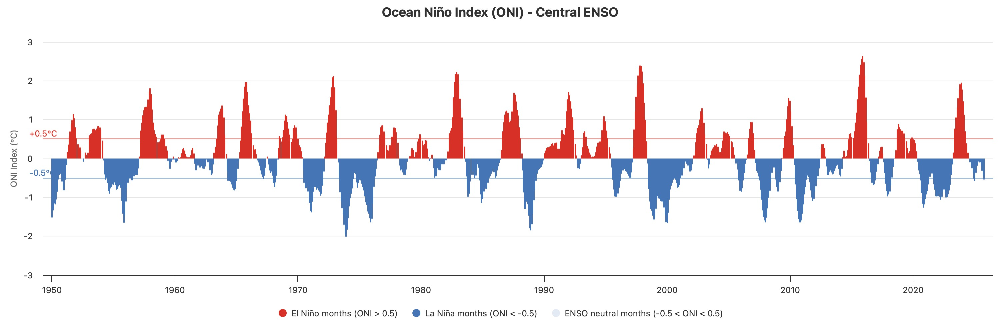{height=400px}

**Figure:** Time series of Oceanic Niño Index (ONI) showing temperature and precipitation anomalies.

**What you can see in this figure**

This figure shows the time series of temperature and precipitation anomalies for the aggregated spatial unit. Red indicates El Niño months and blue indicates La Niña months. Anomalies are calculated for each month relative to the 1950–2020 climatological average.

**Understanding the Data: Implications and Utility**

Because of climate change, El Niño and La Niña events now occur against a shifted baseline, generally warmer, and either drier or wetter depending on the region. When these events are superimposed on long-term trends, their impacts can be amplified. For example, a heatwave or storm triggered during an ENSO phase may become more severe due to accumulated effects. This figure helps us understand the extremes that emerge from the interaction between long-term climate change and ENSO variability.

**What are the key caveats and limitations to consider?**

There is still limited scientific confidence in how climate change may be altering the intensity and frequency of ENSO events. What is shown here focuses only on their combined effects rather than on changes in ENSO itself.

### Distribution Analysis

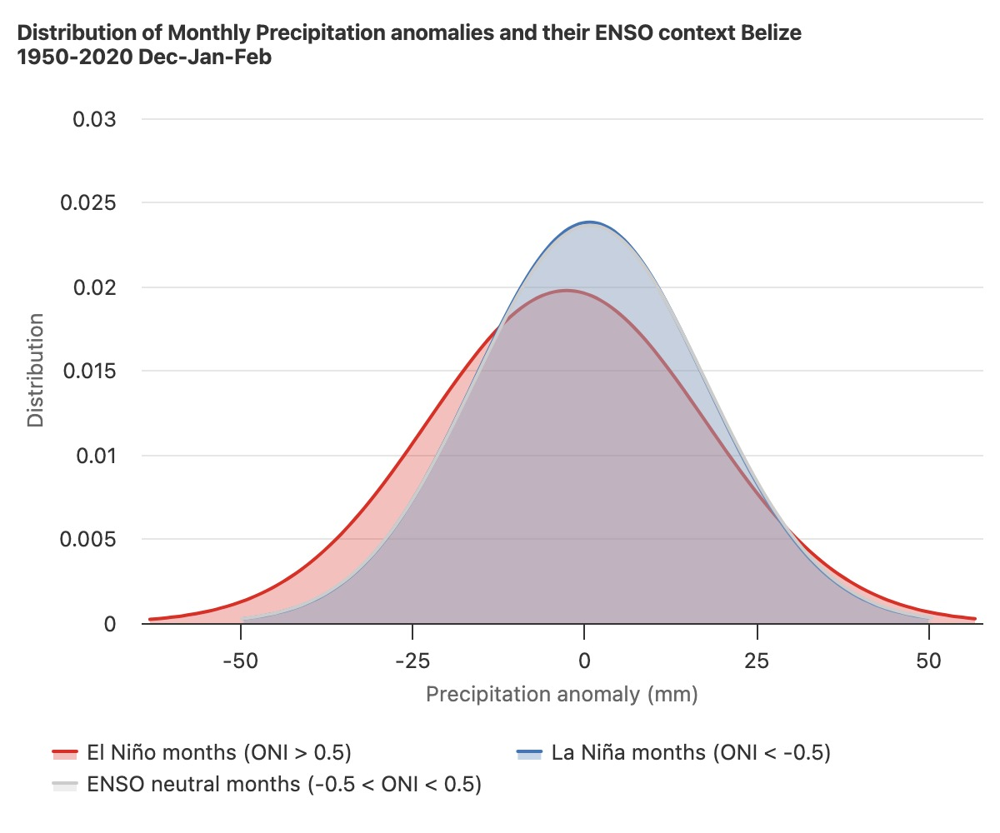{height=400px}

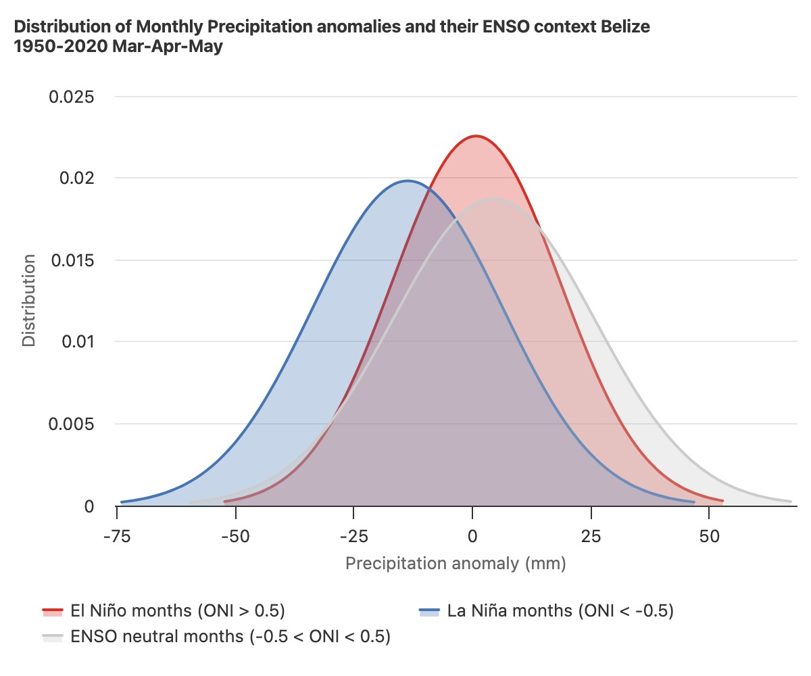{height=400px}

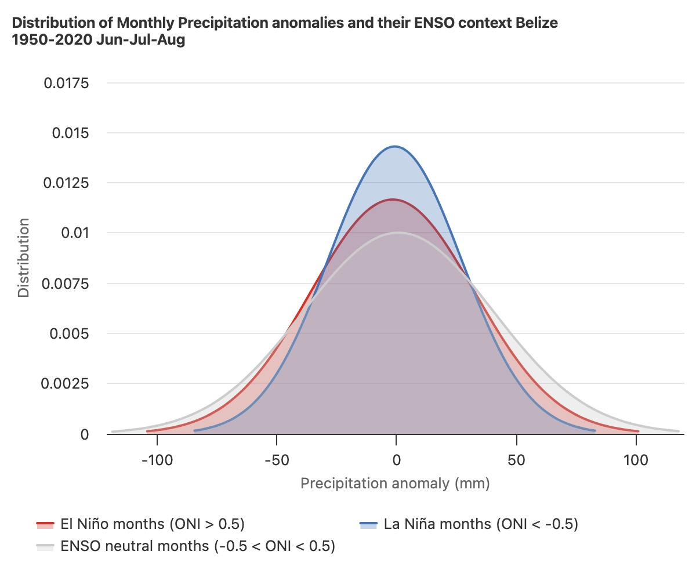{height=400px}

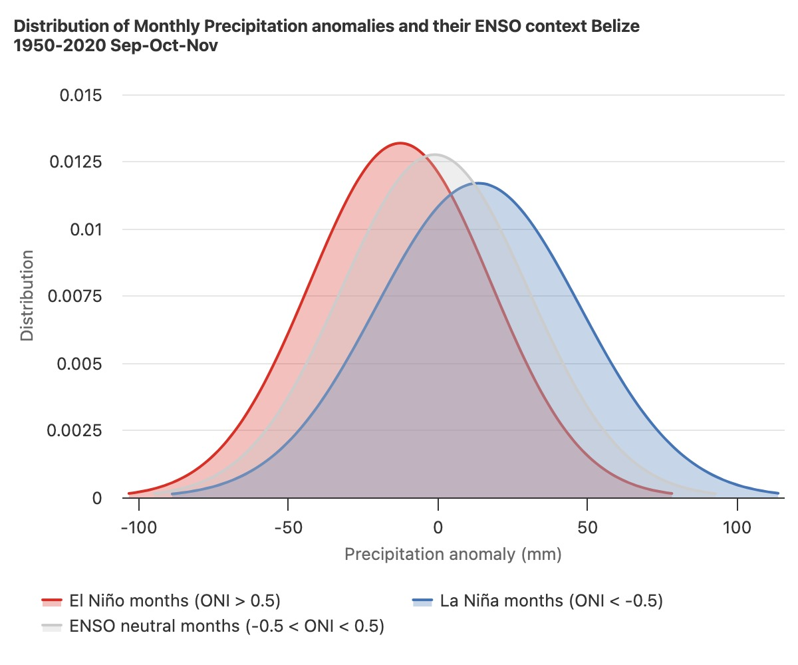{height=400px}

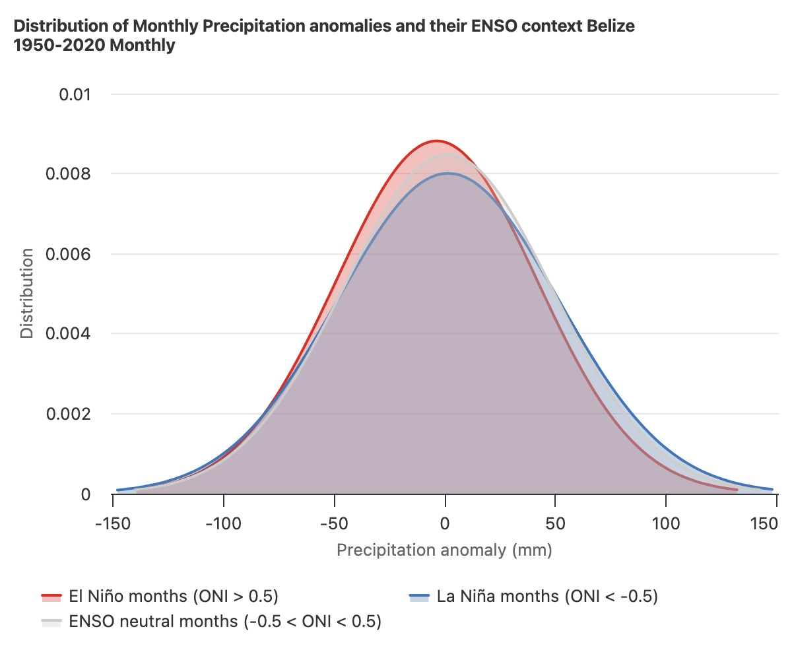{height=400px}

**Figure:** Distribution of monthly and seasonal anomalies for El Niño, La Niña, and neutral ENSO conditions. Seasonal abbreviations: DJF (December-January-February), MAM (March-April-May), JJA (June-July-August), SON (September-October-November).

**What you can see in this figure**

This figure shows the distribution of monthly and seasonal anomalies for El Niño, La Niña, and neutral ENSO conditions. The distributions are approximated using Gaussian curves. Anomalies are computed relative to a long-term trend estimated with a simple quadratic fit (which in general remains flat initially and increases more rapidly in recent years for temperature).

**Understanding the Data: Implications and Utility**

The degree of separation between the El Niño and La Niña distributions reflects the strength of ENSO's influence on temperature or precipitation. In regions where ENSO strongly modulates climate, these distributions are clearly distinct, whereas in areas dominated by other sources of natural variability, they overlap more closely. The long-term climate change trend has been removed to isolate differences attributable solely to ENSO.

### Actionable Insights: ENSO Seasonal Patterns

The ENSO distribution analysis reveals important seasonal variations in the strength and direction of ENSO's influence on Belize's climate:

**SON (September-October-November) - Strong Signal:** The distribution analysis for SON shows a significant separation between El Niño and La Niña curves, indicating a strong ENSO influence during this period. In Belize, La Niña strongly correlates with wetter-than-average conditions during the peak of the hurricane season, while El Niño correlates with drier-than-average conditions during this same period. This is the most reliable window for forecast-based action, as the strong ENSO signal during SON provides greater confidence in seasonal forecasts and enables more effective climate risk assessment planning for both flood risk (La Niña) and drought risk (El Niño) during the critical hurricane season months.

**MAM (March-April-May) - Weak Signal with Atypical Pattern:** In contrast, the MAM distribution shows that El Niño and La Niña distributions overlap more closely than in SON, indicating a weaker ENSO influence during this period. Additionally, the MAM figure reveals an atypical pattern: the El Niño curve (red) peaks slightly toward positive (wetter) anomalies, which is the opposite of the year-round trend where El Niño typically correlates with drier conditions. This suggests that forecast-based action during MAM should rely less heavily on ENSO forecasts and may require additional indicators or local factors to inform climate risk assessment decisions.

---

## Ministry Consultations

*This section summarizes consultations conducted with government ministries and agencies regarding priority natural hazards, preferred datasets, and capacity for community validation.*

### Ministry Contacts

| Ministry | Contact |
|----------|---------|
| **Hydrology (NHS)** | Tennielle Hendy; chief@nhs.gov.bz |
| **Tourism** | Darcy Correa; darcy.correa@tourism.gov.bz |
| **Coastal Zone Management (CZMAI)** | Mrs. Arlene Young (director@coastalzonebelize.org); Mr. Isreal Correa (gismanager@coastalzonebelize.org); Ms. Chelsea Perrera (coastalplanner@coastalzonebelize.org) |
| **Livestock** | William Usher; ceo@belizelivestock.org |
| **Forestry** | Wilfredo Zetina; ZetinaW@gobmail.gov.bz |
| **Sustainability / Climate Change** | Judene Tingling-Linares; coord.pppu@environment.gov.bz |

### Ministry Priorities and Capacity

| Ministry | Priority Hazards | Preferred Datasets | Community Validation Capacity |
|----------|------------------|-------------------|------------------------------|
| **Hydrology (NHS)** | - Floods (all types); - Drought | - Twice daily river levels for floods; - Coastal environment data for coastal flooding (needed); - Groundwater levels data nationally for hydrological drought (needed) | Limited due to human resources; can execute where suitable. Primary contact: Tennielle Hendy. Community members read staff gauges; annual training sessions conducted. |
| **Tourism** | - Hurricane; - Flood; - Drought; - Heat waves; - Lightning Storms | - Relevant weather station data country wide; - Gauging stations along rivers | Not specified |
| **Coastal Zone Management (CZMAI)** | **Long-term:** - Increasing sea surface temperature; - Sea level rise. **Short-term:** - Hurricanes/storm surges | - Global datasets on sea temperature rise from satellite sensors; - Sea level data from sea loggers/satellite altimetry/tide gauges; - Hurricane and storm surge forecasts with at least 3 days' notice | CZMAI has capacity and is willing to aid in community validation for risk analysis |
| **Livestock** | 1. Flood; 2. Heat Stress Index (Temperature & Humidity) | - Rain Intensity; - Temperature and Humidity | No capacity available |
| **Forestry** | - Wildland fires; - Drought; - Hurricanes | - Any relevant datasets that are available | Contact person: Wilfredo Zetina. Would need assistance from team at main office (only two officers at San Ignacio station) |
| **Sustainability / Climate Change** | 1. Flooding [Rainfall; discharge, soil moisture]; 2. Tropical cyclones; 3. Wildfires [thermal hotspots/satellite imagery]; 4. Drought (Standardized Precipitation Indices, SPIs) | - Rainfall and discharge data for flooding; - Soil moisture data; - Thermal hotspots/satellite imagery for wildfires; - Standardized Precipitation Indices (SPIs) for drought monitoring | Capacity exists in different departments; human resource limitation to actively participate might be challenging |

---

## Summary of Priority Hazards

Based on the ministry consultations, the following natural hazards are identified as priorities for climate risk assessment:

| Hazard | Number of Ministries Mentioning | Ministries |
|--------|--------------------------------|------------|
| Floods | 5 | Hydrology, Tourism, Livestock, Forestry, Sustainability |
| Drought | 5 | Hydrology, Tourism, Forestry, Sustainability, Livestock |
| Hurricanes/\newline{}Tropical Cyclones | 4 | Tourism, CZMAI, Forestry, Sustainability |
| Heat Waves/Heat Stress | 2 | Tourism, Livestock |
| Wildfires | 2 | Forestry, Sustainability |
| Sea Level Rise | 1 | CZMAI |
| Lightning Storms | 1 | Tourism |

---

## NMA Forecast Products

*Information in this section is based on desk review of NMA forecast products and consultation notes.*

The National Meteorological Agency (NMA) provides forecast products, though their website reliability is a concern. The NMA is the primary government agency responsible for meteorological services in Belize:

1. **Seasonal Forecast:** IRI-style seasonal forecast available
2. **Agricultural Forecast:** Shorter-term agricultural forecast available
3. **Common Alerting Protocol (CAP):** Belize is currently implementing this common standard for short-term disaster alerts via SMS. CAP is an international standard format for exchanging emergency alerts and public warnings.

**Limitations and Data Access Challenges:**

1. **Website reliability issues:** The NMA website has been noted as unreliable, which poses challenges for accessing current forecast information.

2. **Historical forecast data access:** There is no straightforward way to access historical forecast information from the NMA. This limitation affects the ability to:
   - Validate forecast skill and accuracy over time
   - Conduct retrospective analyses of forecast performance
   - Develop forecast-based action triggers based on historical patterns

3. **Alternative data sources:** Given these limitations, the following alternative approaches should be considered:
   - **Public forecast products:** Explore publicly available forecast products from international sources that may provide historical data and verification records
   - **Collaborative research:** Leverage ongoing collaborative research on NextGen forecasting methodology that may provide alternative forecast data sources or historical records
   - **Direct engagement:** Continue engagement with NMA to explore potential data sharing agreements or alternative access methods for historical forecast information

---

## Prior Climate Risk Assessments

*This section summarizes findings from existing climate risk assessments reviewed during the desk review process.*

Existing climate risk assessments have identified the following key considerations:

### Coastal Threats

Coastal areas face multiple interconnected threats that have been a major focus of prior assessments:

- **Coastal biodiversity threats:** Impacts on marine and coastal ecosystems
- **Ocean acidification:** Affecting marine life and coral reef systems
- **Erosion:** Coastal land loss and infrastructure vulnerability
- **Sea level rise:** Long-term threat to coastal communities and infrastructure

**Focus areas:** Prior assessments have placed significant emphasis on **coral reef protection** and **forest protection**, reflecting the importance of these ecosystems for Belize's economy, biodiversity, and coastal resilience.

### Other Hazards Assessed

Additional hazards identified in prior assessments include:

- **Storm surge and flooding:** Coastal and inland flooding risks
- **Heat waves:** Extreme temperature events affecting health and agriculture
- **Drought:** While drought has been assessed, particularly in northern savannah areas, this hazard is considered **less relevant for the current climate risk assessment focus** compared to other priority hazards identified through ministry consultations.

### Key Resources and Data Sources

Several key resources have been identified for understanding climate risks and community vulnerability:

- **Climate Risk Profile:** Contains assessment of communities' adaptive capacity that may be useful to cite. This resource also documents specific adaptation strategies by area, providing valuable context for understanding local resilience and response capacity.

- **EMDAT (Emergency Events Database):** The Emergency Events Database provides historical disaster records, but **data for Belize is quite sparse**, limiting its utility for comprehensive risk analysis. This data gap highlights the importance of alternative data sources and community-based information.

### EMDAT Historical Disaster Data

The following visualizations present historical disaster events recorded in the EM-DAT database for Belize. While the dataset is limited (24 events spanning 1931-2024), it provides valuable insights into the types and patterns of disasters affecting the country. The data primarily includes tropical cyclones (storms) and floods, which aligns with the priority hazards identified through ministry consultations.

```{python}
#| label: emdat-visualizations
#| echo: false
#| fig-width: 7
#| fig-height: 12
#| dpi: 300
#| fig-cap: "EMDAT Historical Disaster Data for Belize (1931-2024)"
#| fig-pos: "H"

import pandas as pd
import matplotlib.pyplot as plt
import matplotlib.dates as mdates
from datetime import datetime
import numpy as np
from pathlib import Path

# Configure matplotlib for PDF optimization
plt.rcParams.update({
    'font.size': 12,
    'axes.labelsize': 14,
    'axes.titlesize': 16,
    'xtick.labelsize': 11,
    'ytick.labelsize': 11,
    'legend.fontsize': 11,
    'figure.titlesize': 18,
    'lines.linewidth': 2.5,
    'axes.linewidth': 2,
    'grid.linewidth': 1.5,
    'xtick.major.width': 2,
    'ytick.major.width': 2,
    'xtick.major.size': 6,
    'ytick.major.size': 6,
})

# Read the EMDAT Excel file
excel_file = Path("public_emdat_custom_request_2025-12-23_3fadd991-94bf-4952-9979-b952e768de7f.xlsx")
df = pd.read_excel(excel_file, sheet_name='EM-DAT Data')

# Clean and prepare data
df['Start Year'] = df['Start Year'].astype(int)
df['Start Month'] = df['Start Month'].fillna(1).astype(int)
df['Start Day'] = df['Start Day'].fillna(1).astype(int)

# Create date column for timeline
df['Start Date'] = pd.to_datetime({
    'year': df['Start Year'],
    'month': df['Start Month'],
    'day': df['Start Day']
})

# Fill NaN values for impact metrics
df['Total Deaths'] = df['Total Deaths'].fillna(0)
df['No. Affected'] = df['No. Affected'].fillna(0)
df['Total Affected'] = df['Total Affected'].fillna(0)
df['Total Damage, Adjusted (\'000 US$)'] = df['Total Damage, Adjusted (\'000 US$)'].fillna(0)

# Create figure with three subplots
fig = plt.figure(figsize=(14, 12))
gs = fig.add_gridspec(3, 1, hspace=0.4, top=0.95, bottom=0.08)

# Color scheme optimized for PDF (colorblind-friendly, grayscale-readable)
colors = {
    'Storm': '#2E86AB',      # Blue
    'Flood': '#A23B72',      # Purple
    'Other': '#F18F01'       # Orange
}

# Map disaster types to simplified categories
def categorize_disaster(disaster_type):
    if pd.isna(disaster_type):
        return 'Other'
    disaster_str = str(disaster_type).lower()
    if 'storm' in disaster_str or 'cyclone' in disaster_str:
        return 'Storm'
    elif 'flood' in disaster_str:
        return 'Flood'
    else:
        return 'Other'

df['Disaster Category'] = df['Disaster Type'].apply(categorize_disaster)

# 1. Timeline Visualization
ax1 = fig.add_subplot(gs[0, 0])
for category in df['Disaster Category'].unique():
    mask = df['Disaster Category'] == category
    dates = df.loc[mask, 'Start Date']
    affected = df.loc[mask, 'Total Affected']
    # Size markers by total affected (with minimum size)
    sizes = np.maximum(affected / 1000, 50)  # Scale down, minimum 50
    ax1.scatter(dates, [1] * len(dates), s=sizes, 
                c=colors[category], label=category, 
                alpha=0.7, edgecolors='black', linewidths=1.5, zorder=3)

# Add event names as annotations for major events
# Sort by date to handle overlapping labels better
major_events = df.nlargest(5, 'Total Affected').sort_values('Start Date')
# Use alternating vertical offsets to prevent overlap
y_offsets = [15, 25, 15, 25, 15]  # Alternate between two levels
for idx, (_, row) in enumerate(major_events.iterrows()):
    if pd.notna(row['Event Name']):
        y_offset = y_offsets[idx % len(y_offsets)]
        ax1.annotate(row['Event Name'], 
                    xy=(row['Start Date'], 1),
                    xytext=(5, y_offset), textcoords='offset points',
                    fontsize=9, ha='left',
                    bbox=dict(boxstyle='round,pad=0.3', facecolor='white', alpha=0.8, edgecolor='black', linewidth=1))

ax1.set_xlabel('Year', fontsize=14, fontweight='bold')
ax1.set_ylabel('', fontsize=14)
ax1.set_title('Timeline of Historical Disasters in Belize (1931-2024)', fontsize=16, fontweight='bold', pad=15)
ax1.set_yticks([])
ax1.grid(True, alpha=0.3, linestyle='--', linewidth=1.5)
ax1.legend(loc='upper left', frameon=True, fancybox=True, shadow=True, fontsize=11)
ax1.xaxis.set_major_locator(mdates.YearLocator(10))
ax1.xaxis.set_major_formatter(mdates.DateFormatter('%Y'))
ax1.xaxis.set_minor_locator(mdates.YearLocator(5))
plt.setp(ax1.xaxis.get_majorticklabels(), rotation=45, ha='right')

# 2. Distribution by Disaster Type
ax2 = fig.add_subplot(gs[1, 0])
disaster_counts = df['Disaster Category'].value_counts()
bars = ax2.bar(disaster_counts.index, disaster_counts.values, 
               color=[colors[cat] for cat in disaster_counts.index],
               edgecolor='black', linewidth=2, alpha=0.8)

# Add value labels on bars with small offset to prevent overlap
for i, (bar, count) in enumerate(zip(bars, disaster_counts.values)):
    height = bar.get_height()
    # Add small offset above bar to prevent overlap with bar edge
    label_y = height + max(disaster_counts.values) * 0.02
    ax2.text(bar.get_x() + bar.get_width()/2., label_y,
             f'{count}\n({count/len(df)*100:.1f}%)',
             ha='center', va='bottom', fontsize=12, fontweight='bold')

ax2.set_xlabel('Disaster Type', fontsize=14, fontweight='bold')
ax2.set_ylabel('Number of Events', fontsize=14, fontweight='bold')
ax2.set_title('Distribution of Disasters by Type', fontsize=16, fontweight='bold', pad=15)
ax2.grid(True, alpha=0.3, linestyle='--', axis='y', linewidth=1.5)
ax2.set_ylim(0, max(disaster_counts.values) * 1.2)

# 3. Comparison Chart - Impact Metrics by Disaster Type
ax3 = fig.add_subplot(gs[2, 0])

# Calculate aggregated metrics by disaster type
comparison_data = df.groupby('Disaster Category').agg({
    'Total Deaths': 'sum',
    'Total Affected': 'sum',
    'Total Damage, Adjusted (\'000 US$)': 'sum'
}).fillna(0)

# Normalize damage for better visualization (convert to millions)
comparison_data['Total Damage (Millions US$)'] = comparison_data['Total Damage, Adjusted (\'000 US$)'] / 1000

# Create grouped bar chart
x = np.arange(len(comparison_data.index))
width = 0.25

# Normalize values for better comparison (use log scale or normalize)
deaths_norm = comparison_data['Total Deaths'] / comparison_data['Total Deaths'].max() if comparison_data['Total Deaths'].max() > 0 else comparison_data['Total Deaths']
affected_norm = comparison_data['Total Affected'] / comparison_data['Total Affected'].max() if comparison_data['Total Affected'].max() > 0 else comparison_data['Total Affected']
damage_norm = comparison_data['Total Damage (Millions US$)'] / comparison_data['Total Damage (Millions US$)'].max() if comparison_data['Total Damage (Millions US$)'].max() > 0 else comparison_data['Total Damage (Millions US$)']

bars1 = ax3.bar(x - width, deaths_norm, width, label='Total Deaths (normalized)', 
                color='#D32F2F', edgecolor='black', linewidth=1.5, alpha=0.8)
bars2 = ax3.bar(x, affected_norm, width, label='Total Affected (normalized)', 
                color='#388E3C', edgecolor='black', linewidth=1.5, alpha=0.8)
bars3 = ax3.bar(x + width, damage_norm, width, label='Total Damage (normalized)', 
                color='#F57C00', edgecolor='black', linewidth=1.5, alpha=0.8)

ax3.set_xlabel('Disaster Type', fontsize=14, fontweight='bold')
ax3.set_ylabel('Normalized Impact (0-1 scale)', fontsize=14, fontweight='bold')
ax3.set_title('Comparison of Impact Metrics by Disaster Type', fontsize=16, fontweight='bold', pad=15)
ax3.set_xticks(x)
ax3.set_xticklabels(comparison_data.index)
ax3.legend(loc='upper left', frameon=True, fancybox=True, shadow=True, fontsize=11)
ax3.grid(True, alpha=0.3, linestyle='--', axis='y', linewidth=1.5)

# Add actual values as text annotations
# Use horizontal text to prevent overlap and improve readability
for i, (idx, row) in enumerate(comparison_data.iterrows()):
    # Calculate offsets to prevent overlap
    offset_deaths = 0.05
    offset_affected = 0.05
    offset_damage = 0.05
    
    if row['Total Deaths'] > 0:
        ax3.text(i - width, deaths_norm.iloc[i] + offset_deaths, 
                f"{int(row['Total Deaths'])}", 
                ha='center', va='bottom', fontsize=9, rotation=0)
    if row['Total Affected'] > 0:
        ax3.text(i, affected_norm.iloc[i] + offset_affected, 
                f"{int(row['Total Affected']/1000)}k", 
                ha='center', va='bottom', fontsize=9, rotation=0)
    if row['Total Damage (Millions US$)'] > 0:
        ax3.text(i + width, damage_norm.iloc[i] + offset_damage, 
                f"${row['Total Damage (Millions US$)']:.0f}M", 
                ha='center', va='bottom', fontsize=9, rotation=0)

# Adjust y-axis limits to accommodate labels
max_norm = max(deaths_norm.max(), affected_norm.max(), damage_norm.max())
ax3.set_ylim(0, max_norm * 1.15)

# Use subplots_adjust instead of tight_layout to avoid compatibility issues
fig.subplots_adjust(hspace=0.4, top=0.95, bottom=0.08)
plt.show()  # Display the figure for Quarto to capture
```

**Figure:** Historical disaster events from the EM-DAT database for Belize (1931-2024). Top panel shows a timeline of disasters with marker size proportional to total affected population. Middle panel displays the distribution of disasters by type. Bottom panel compares normalized impact metrics (deaths, affected population, and economic damage) across disaster types. Note: The dataset contains 24 events, with tropical cyclones (storms) and floods being the primary disaster types.

- **World Bank:** The World Bank has **some additional data** beyond what is available in EMDAT, providing a supplementary source for understanding historical disaster impacts and climate risks in Belize.

---

## Data Inventory

*This section presents the comprehensive data inventory compiled during the desk review process, identifying candidate datasets for the climate risk assessment and maptool development.*

The following datasets have been identified for the Belize climate risk assessment project. These datasets are organized by category: **Hazard**, **Exposure/Vulnerability/Impact**, and **Forecasts/Projections**. This inventory serves as a foundation for:

- Identifying candidate datasets for the design dashbboard development
- Understanding data availability and gaps across hazard, exposure, and vulnerability dimensions
- Informing data acquisition and integration strategies
- Supporting community validation efforts by identifying where local information can fill data gaps

The data inventory is generated from an Excel workbook containing multiple sheets. Each category is processed and displayed as a formatted table below. The inventory includes datasets relevant for:

- **Hazard assessment:** Datasets for measuring and monitoring priority natural hazards identified through ministry consultations
- **Exposure and vulnerability:** Datasets for understanding what and who is at risk, including population, infrastructure, and socioeconomic indicators
- **Forecasts and projections:** Datasets for climate risk assessment and future climate scenarios

```{python}
#| label: data-inventory
#| echo: false
#| output: asis
#| fig-cap: "Data inventory tables generated from Excel workbook"
import pandas as pd
from pathlib import Path

# Read the Excel file containing data inventory sheets
excel_file = Path("Belize Data Inventory.xlsx")
xl_file = pd.ExcelFile(excel_file)

# Function to convert dataframe to markdown table format
# This ensures proper formatting for display in the rendered document
def df_to_markdown(df):
    """Convert pandas DataFrame to markdown table format"""
    # Replace NaN with empty string
    df = df.fillna('')
    
    # Get column names
    cols = list(df.columns)
    
    # Create header
    markdown = "| " + " | ".join(cols) + " |\n"
    markdown += "| " + " | ".join(["---"] * len(cols)) + " |\n"
    
    # Add rows
    for _, row in df.iterrows():
        values = [str(val).replace('|', '\\|') for val in row.values]
        markdown += "| " + " | ".join(values) + " |\n"
    
    return markdown

# Process each sheet and output tables
# Maps Excel sheet names to section headings in the document
sheet_mapping = {
    'Hazard': '### Hazard Datasets',
    'Exposure, Vulnerability, Impact': '### Exposure, Vulnerability, Impact Datasets',
    'Forecasts, Projections': '### Forecasts, Projections Datasets'
}

# Iterate through sheets and generate formatted tables
for sheet_name in xl_file.sheet_names:
    if sheet_name in sheet_mapping:
        df = pd.read_excel(excel_file, sheet_name=sheet_name)
        print(f"\n{sheet_mapping[sheet_name]}\n")
        print(df_to_markdown(df))
```

---

## Community Information Integration

*This section outlines the approach for incorporating community information into the risk analysis, based on desk review findings, ministry consultation feedback, and IRI methodologies for climate risk assessment.*


### IRI Methodologies for Community Engagement

The integration of community information will leverage IRI's standardized methodologies that have been successfully applied at scale in multiple countries:

**Farmer Focus Group Methodologies:** IRI's participatory approach employs structured community discussions to elicit historical risk years from farmers. This methodology enables communities to rank their worst disaster years for specific hazards (e.g., drought, flooding), which can then be compared against climate data to validate forecast decision rules. For example, a drought action rule meant to trigger during a 1-in-5-year drought can be validated against the worst years farmers recall from the past 40 years. The methodology is based on consensus-building among community members, ensuring that the final result represents collective local knowledge.

**Interactive Educational Exercises:** IRI's approach includes "games" or simulations that demonstrate potential household-level decisions that climate risk assessment can inform, while simultaneously understanding farmers' typical production and investment constraints. These exercises help elucidate the theory of change for climate risk assessment and check its plausibility: for example, understanding whether farmers would make productive investments (like improved seeds) if climate risk information could inform input decisions before a drought year.

**Mobile Crowdsourcing Tools:** In cases where financial, logistical, or safety constraints limit the feasible scale of in-person focus groups, IRI has developed mobile tools leveraging commonly used messaging platforms like WhatsApp. These tools use behavioral design elements and incentives to elicit reliable responses from farmers, enabling scalable data collection. These tools have been successfully piloted with hundreds of farmers and include dashboards that allow non-technical users to deploy, customize, and monitor survey campaigns.

**Data Cleaning and Reconciliation Tools:** Given that community-generated data is subject to entry errors, inaccurate recall, and other complexities, IRI has developed tools to help local users visualize crowdsourced data on historical risk years over multiple spatial scales, identify probable errors, and enter corrections via a centralized ledger. Additionally, IRI has developed a methodology based on information theory for integrating multiple observational datasets and qualitative data (like farmers' recall) into a holistic assessment of historical drought tendency.

**Seasonal Assessment Methodology:** A critical component of climate risk assessment is continual monitoring throughout the season to assess policy performance, identify gaps, and reconcile stakeholders' expectations. IRI's seasonal assessment methodology draws on multiple sources of data, including biophysical measurements, crowdsourced reports from farmers, and humanitarian food security monitoring, presenting stakeholders with structured questions to gather informed assessments of seasonal conditions.

**IRI Tool Platforms and Resources:**

- **Forecast Action Planning Tools:** Interactive map tools for visualizing forecasted disaster severity and evaluating decision rules (example: http://iridl.ldeo.columbia.edu/fbfmaproom2/ethiopia-ond). These tools allow users to adjust outcome types and severity thresholds, incorporate observational data, and evaluate historical performance.

- **Data Cleaning Tools:** Centralized platforms for quality-checking crowdsourced data (example: https://fist-cleandat.iri.columbia.edu/comzambia). These tools enable visualization of historical risk years over multiple spatial scales and error correction via centralized ledgers.

- **Decision Support Tools:** Interactive tools for developing and evaluating AA decision rules, including examples from index insurance applications (https://fist-shiny.iri.columbia.edu/shiny_apps/Apps/Zambia_Window_consolidation_app/, https://fist-shiny.iri.columbia.edu/shiny_apps/Apps/zambia_optimization_app/).

- **AA Training Materials:** Comprehensive training resources for AA trigger development (example: https://fist.iri.columbia.edu/publications/docs/Lesotho_FbF_Material2022/ - username: FBFLesotho, password: resilience).

- **Next Generation Drought Index (NGDI):** Participatory tool for co-generation and evaluation of satellite datasets and insurance solutions (https://bit.ly/WBIRISenOpt - username: WB, password: IRI).

- **Seasonal Assessment Resources:** Methodology documentation and examples (https://fist.iri.columbia.edu/publications/docs/r4mozEOS2022/).

- **IRI Climate Data Tools (CDT):** Software package for quality control of climate data (https://iri.columbia.edu/our-expertise/climate/tools/cdt/).

- **IRI Climate Predictability Tool (CPT):** User-friendly platform for producing tailored seasonal climate forecasts (https://iri.columbia.edu/our-expertise/climate/tools/cpt/).

- **ENACTS Initiative:** Methods, tools and training for developing high-resolution climate datasets and Maprooms (https://iri.columbia.edu/resources/enacts/).


### Integration Strategy

The community information integration process will follow an enhanced approach that incorporates IRI methodologies:

1. **Identify relevant use cases:** Identify priority use cases that would benefit from community validation and local knowledge integration, focusing on hazards where community input can fill critical data gaps or validate technical assessments.

2. **Historical risk event validation:** Conduct Farmer Focus Groups using IRI's standardized methodology to elicit community-identified historical disaster years. This information is critical for retrospective evaluation of climate risk assessment decision rules, ensuring that forecast triggers align with community experiences of actual disaster events.

3. **Gather community information:** Employ multiple engagement modalities:
   - **In-person focus groups:** Structured community discussions in accessible locations with special consideration for indigenous communities in Toledo requiring culturally-appropriate engagement
   - **Mobile crowdsourcing:** WhatsApp-based tools for areas where in-person focus groups are constrained by logistics, safety, or financial limitations
   - **Interactive educational exercises:** Games and simulations to understand household-level decisions and validate the theory of change for climate risk assessment interventions

4. **Validate metrics and decision rules:** Validate risk metrics, hazard indicators, and forecast decision rules through community engagement:
   - Compare technical assessments against local experiences and observations
   - Validate that climate risk assessment triggers would have captured known historical disaster events
   - Ensure decision rules align with community-identified worst years for each hazard
   - Use community input to refine trigger thresholds and action protocols

5. **Fill data gaps:** Frame community information collection as a means to fill gaps in existing data sources, particularly where:
   - Official monitoring networks are sparse (e.g., groundwater levels for hydrological drought, upper catchment river gauges)
   - Historical records are incomplete (e.g., EMDAT data limitations for Belize)
   - Local impacts and vulnerabilities are not captured in national datasets
   - Community-specific adaptation strategies and capacities need documentation

6. **Data quality assurance:** Implement IRI's data cleaning and reconciliation processes:
   - Visualize crowdsourced data on historical risk years over multiple spatial scales
   - Identify and correct probable errors through centralized quality-checking tools
   - Integrate multiple observational datasets and qualitative data using information theory-based methodologies

7. **Seasonal monitoring:** Establish continual monitoring protocols using IRI's seasonal assessment methodology, drawing on biophysical measurements, crowdsourced farmer reports, and humanitarian food security monitoring to assess climate risk assessment policy performance throughout the season.

### Technology Platforms and Decision Support

**Decision Support Tools Integration:** Community input will directly inform the development and evaluation of climate risk assessment decision rules using IRI's decision support methodology. This includes:
- Creating an inventory of threshold/trigger methodologies used by stakeholders to enhance harmonization
- Generating lists of known historical disaster events for each region and sector to validate decision rule performance
- Developing trainings for applicable agencies on the use of triggers and impact-based thresholds
- Creating learning notes that explain the complete trigger/threshold development process

**Participatory Validation:** Community recall of historical disaster years will be systematically compared against climate data to validate forecast decision rules. This participatory validation ensures that technical climate risk assessment triggers capture events that communities recognize as disasters, reducing basis risk and increasing community trust in the system.

**Multi-Source Integration:** Community data will be integrated with:
- Biophysical measurements (satellite data, gauge readings, weather station data)
- Humanitarian food security monitoring (IPC/VAM assessments)
- Government administrative data
- Expert knowledge from ministry consultations

This multi-source approach enables a holistic assessment of historical risk tendency and strengthens the foundation for climate risk assessment decision rules.


## References

### Consultation Sources

**Ministry Consultations (2024):**

- **Hydrology (NHS):** Consultation with Tennielle Hendy (chief@nhs.gov.bz)
- **Tourism:** Consultation with Darcy Correa (darcy.correa@tourism.gov.bz)
- **Coastal Zone Management (CZMAI):** Consultations with Mrs. Arlene Young (director@coastalzonebelize.org), Mr. Isreal Correa (gismanager@coastalzonebelize.org), and Ms. Chelsea Perrera (coastalplanner@coastalzonebelize.org)
- **Livestock:** Consultation with William Usher (ceo@belizelivestock.org)
- **Forestry:** Consultation with Wilfredo Zetina (ZetinaW@gobmail.gov.bz)
- **Sustainability / Climate Change:** Consultation with Judene Tingling-Linares (coord.pppu@environment.gov.bz)

### Data Sources

- **Belize Data Inventory:** Excel workbook containing comprehensive dataset inventory (Belize Data Inventory.xlsx)
- **EMDAT (Emergency Events Database):** Historical disaster records (noted as sparse for Belize)
- **World Bank:** Climate risk data and assessments
- **Climate Risk Profile:** Assessment of communities' adaptive capacity and adaptation strategies

### Climate Data Sources

- **World Bank Climate Change Knowledge Portal (CCKP):** Climate context information, visualizations, and analyses for Belize. Available at: https://climateknowledgeportal.worldbank.org/country/belize
- **NOAA ETOPO Global Relief Model:** Topographic elevation data. Available at: https://www.ncei.noaa.gov/products/etopo-global-relief-model
- **Gridded Population of the World, Version 4 (GPWv4):** Population density data. Available at: https://cmr.earthdata.nasa.gov/search/concepts/C1597159135-SEDAC.html

### Forecast Products

- **National Meteorological Agency (NMA), Belize:** Seasonal forecasts, agricultural forecasts, and Common Alerting Protocol (CAP) implementation

### Desk Review Notes

- Consultation notes and findings compiled during the desk review process (Belize desk review notes.txt)

### Climate Risk Analysis Plan Sources

**Citations from Section 1 (Executive Summary):**

1. Climate Risk Profile: Belize - International Institute for Sustainable Development, accessed December 15, 2025, https://www.iisd.org/system/files/2025-04/belize-climate-risk-profile.pdf

2. Belize Bolsters Climate and Disaster Resilience with the World Bank's Support, accessed December 15, 2025, https://www.worldbank.org/en/news/press-release/2025/07/29/belize-bolsters-climate-and-disaster-resilience-with-the-world-bank-s-support

